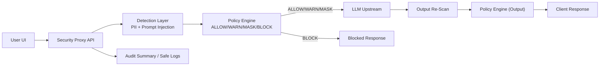

# Capstone Design - LLM Security Proxy MVP

공공기관/사내망 환경에서 LLM 사용 시 개인정보 유출과 프롬프트 인젝션을 줄이기 위한
정책/탐지 중심 MVP 코드베이스입니다.

## 실행 환경

- Python: **3.10.x 권장** (프로젝트 기준: `>=3.10,<3.12`)
- 설치:
  - `pip install .`
  - 개발/테스트 포함: `pip install ".[dev]"`

## 벤치마크 요약 (예시)

> `evaluation/sample_dataset.json` (총 40건) 기준 결과

| 항목 | Precision | Recall | F1 | TP / FP / FN |
|---|---:|---:|---:|---:|
| PII Detection | 0.941 | 0.941 | 0.941 | 16 / 1 / 1 |
| Prompt Injection Detection | 1.000 | 0.938 | 0.968 | 15 / 0 / 1 |

## 아키텍처



## 핵심 범위

- YAML 정책 기반 판정 (`ALLOW`, `WARN`, `MASK`, `BLOCK`)
- PII 탐지 (이메일, 휴대전화, 주민번호, 계좌 유사 패턴)
- Prompt Injection 탐지 (한/영 룰 기반)
- 마스킹 유틸 및 정책 엔진
- 정량 평가(precision/recall/F1)
- 프록시 입력/출력 단계 정책 적용
- pytest 테스트

## 프로젝트 구조

```text
backend/
  app/
    api/
      proxy.py
    detection/
      models.py
      reason_codes.py
      pii_detector.py
      injection_detector.py
    engine/
      masking.py
      policy_engine.py
  tests/
    test_pii_detector.py
    test_injection_detector.py
    test_masking.py
    test_policy_engine.py
    test_proxy_api.py
policies/
  policy.yaml
evaluation/
  sample_dataset.json
  evaluate.py
  report_generator.py
```

## 프록시 동작 흐름 (`backend/app/api/proxy.py`)

1. 입력 텍스트를 PII + Injection 탐지
2. `policy.yaml`로 입력 단계 action 결정
3. `BLOCK`이면 즉시 차단, `MASK`면 마스킹 후 LLM 호출
4. LLM 응답을 다시 탐지/정책 평가
5. 출력이 `BLOCK`이면 차단, `MASK`면 마스킹 후 반환
6. 응답에 `action`, `input_action`, `output_action`, `reasons`, `audit_summary` 포함
   (`audit_summary`에는 `timestamp_utc`, `latency_ms`, `pii_detected`, `injection_detected` 요약 포함)

## 실행 방법

1. 의존성 설치

```bash
pip install ".[dev]"
```

2. 테스트 실행

```bash
python -m pytest -q
```

3. 평가 실행

```bash
python -m evaluation.evaluate \
  --dataset evaluation/sample_dataset.json \
  --report evaluation/evaluation_report.md
```

4. FastAPI 프록시 실행

```bash
python -m uvicorn backend.app.api.proxy:app --host 127.0.0.1 --port 8000 --reload
```

## 확장 아이디어

- Presidio 어댑터 추가
- 정책 버전/테넌트별 정책 파일 분리
- 감사 로그 저장소 연계 (원문 미저장 원칙 유지)
- FastAPI 실제 라우터 + 인증 미들웨어 통합

## 문서

- 정책/threshold/reason code 가이드: `docs/policy_guide.md`
- 발표 시연 시나리오: `docs/demo_scenario.md`
- 로그 저장/미저장 정책: `docs/logging_policy.md`
