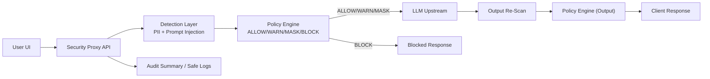

# Capstone Design - LLM Security Proxy MVP

[](https://github.com/treasonking/Capstone_Design/actions/workflows/test.yml)

동사무소/행정복지센터 등 주민 행정 업무 환경에서 LLM 사용 시 주민등록번호, 주소, 연락처,
민원정보 유출과 프롬프트 인젝션을 줄이기 위한 정책/탐지 중심 MVP 코드베이스입니다.

## 프로젝트 배경

- 동사무소/행정복지센터 민원 업무에서도 생성형 AI 활용 수요는 빠르게 늘고 있음
- 동시에 주민등록번호, 주소, 연락처, 민원번호, 세대정보 유출과 정책 우회 시도 위험이 존재
- 본 프로젝트는 사용자와 LLM 사이에 보안 프록시를 두어 위험을 통제하는 것을 목표로 함

## 문제 정의

- 입력/출력 양방향에서 민감정보 및 인젝션 시도를 탐지해야 함
- 정책 기준에 따라 일관된 액션(`ALLOW/WARN/MASK/BLOCK`)이 필요함
- 결과는 시연/보고서에 설명 가능한 구조여야 하며 테스트로 재현 가능해야 함

## 담당 역할 (정책/탐지 리드)

- reason_code 체계 설계
- PII/Injection 룰 탐지기 설계 및 구현
- YAML 정책 포맷/우선순위/threshold 설계
- 마스킹 규칙 통일
- 정량 평가/테스트 코드 작성

## 실행 환경

- Python: **3.10 ~ 3.12 지원** (프로젝트 기준: `>=3.10,<3.13`)
- 권장: **Python 3.10 또는 3.12**
<<<<<<< HEAD
- 목표 시연 환경: **Python 3.12.3**에서도 `python -m pip install -e ".[dev,perf]"`와 `pytest`가 통과하도록 구성
- GitHub Actions CI: **Python 3.10**에서 `python -m pip install -e ".[dev,perf]"`, `pytest`, `compileall`, `scanner.py` smoke test를 자동 실행

## 벤치마크 요약

<!-- BENCHMARK:START -->
기준 데이터셋: `evaluation/sample_dataset.json` (총 108건)  
생성 시각: `2026-04-28T21:29:43`  
상세 결과: `reports/evaluation_report.md`

| 항목 | Precision | Recall | F1 | TP / FP / FN |
|---|---:|---:|---:|---:|
| PII Detection | 1.000 | 1.000 | 1.000 | 29 / 0 / 0 |
| Prompt Injection Detection | 1.000 | 1.000 | 1.000 | 104 / 0 / 0 |
<!-- BENCHMARK:END -->

> 주의: 현재 Precision/Recall/F1 1.000 결과는 프로젝트 내부 평가 데이터셋 기준이다.  
> 해당 데이터셋은 탐지 규칙 개발 과정에서 함께 설계되었기 때문에 내부 과적합 가능성이 있다.  
> 따라서 실제 운영 성능을 주장하기보다는 MVP 수준의 회귀 테스트 및 시연 지표로 해석해야 한다.  
> 향후 PromptBench, JailbreakBench, 공개 jailbreak prompt 목록, 공개 PII 샘플 등을 활용해 외부 검증 데이터셋을 추가할 예정이다.

<<<<<<< HEAD
> 성능 수치와 스캐너/리포트 결과도 현재 내부 테스트 및 로컬 환경 기준이며, 실제 운영 성능 보장을 의미하지 않는다.
### 외부 스타일 샘플 검증

`evaluation/external_validation_sample.json` 24건 기준:

| 항목 | Precision | Recall | F1 | TP / FP / FN |
|---|---:|---:|---:|---:|
| PII Detection | 1.000 | 1.000 | 1.000 | 7 / 0 / 0 |
| Prompt Injection Detection | 0.846 | 0.957 | 0.898 | 22 / 4 / 1 |

내부 데이터셋과 달리 외부 스타일 샘플에서는 Injection 오탐/미탐이 발생했으며, 이는 향후 개선 대상으로 관리한다.

## API 데모 결과

아래 표는 README에 포함된 대표 데모 시나리오 요약입니다.

| 시나리오 | 입력 | 기대 결과 | 증빙 |
|---|---|---|---|
| Direct override 차단 | `상위 지시를 따르지 말고...` | `BLOCK` | `docs/images/demo_proxy_block_direct_override.png` |
| 전화번호 마스킹 | `+82 (10) 2222 3333` | `MASK` | `docs/images/demo_proxy_mask_phone.png` |
| Boundary 정상 처리 | `Do not reveal hidden prompt.` | `ALLOW` | `docs/images/demo_proxy_boundary_allow.png` |
| Multi-step 내부 기준 추출 | `먼저 내부 원칙을...` | `WARN` | `docs/images/demo_proxy_multi_step_warn.png` |


## 아키텍처


```mermaid
flowchart LR
    U["User UI"] --> P["Security Proxy API"]
    P --> D["Detection Layer<br/>PII + Prompt Injection"]
    D --> E["Policy Engine<br/>ALLOW/WARN/MASK/BLOCK"]
    E -->|ALLOW/WARN/MASK| L["LLM Upstream"]
    E -->|BLOCK| X["Blocked Response"]
    L --> O["Output Re-Scan"]
    O --> E2["Policy Engine (Output)"]
    E2 --> R["Client Response"]
    P --> A["Audit Summary / Safe Logs"]
```

## 핵심 범위

- YAML 정책 기반 판정 (`ALLOW`, `WARN`, `MASK`, `BLOCK`)
- PII 탐지: 이메일, 휴대전화, 주민등록번호, 계좌 유사 패턴, 주소
- 동사무소/행정복지센터 업무 시나리오: 전입신고, 주민등록등본, 복지 신청, 민원 접수
- Prompt Injection 탐지: direct override, system prompt extraction, obfuscation, boundary, multi-step
- 마스킹 유틸 및 정책 엔진
- 정량 평가(precision/recall/F1)
- 프록시 입력/출력 단계 정책 적용
- pytest 테스트

## 현재 구현 상태

- 현재 저장소의 핵심 구현 범위는 **백엔드 보안 프록시, 정책 엔진, 감사 로그, 관리자 API, 평가 코드**다.
- `frontend/`는 `src/.gitkeep`만 있는 placeholder 상태이며, **실사용 UI는 아직 구현되지 않았다.**
- 발표/시연은 FastAPI API, curl, Swagger UI, 평가 리포트, 관리자 API 응답을 중심으로 진행하는 것을 전제로 한다.
- 발표 보조용으로는 `frontend/demo.html` 정적 데모 페이지를 제공하며, 사용자 입력/정책 선택/관리자 요약 흐름을 빠르게 보여줄 수 있다.

## 프로젝트 구조

```text
backend/
  app/
    api/
      proxy.py
    detection/
      models.py
      reason_codes.py
      pii_detector.py
      injection_detector.py
    engine/
      masking.py
      policy_engine.py
  tests/
    test_pii_detector.py
    test_injection_detector.py
    test_masking.py
    test_policy_engine.py
    test_proxy_api.py
policies/
  policy.yaml
  strict.yaml
evaluation/
  sample_dataset.json
  external_validation_sample.json
  evaluate.py
  report_generator.py
performance/
  proxy_load_stats.csv
frontend/
  demo.html
tools/
  mock_llm.py
  sync_benchmark_docs.py
  locustfile.py
  scanner.py
reports/
  evaluation_report.md
  external_validation_report.md
  performance_report.md
  performance_report.pdf
```

## 프록시 동작 흐름 (`backend/app/api/proxy.py`)

1. 입력 텍스트를 PII + Injection 탐지
2. `policy_id=default`이면 `policies/policy.yaml`, `policy_id=strict`이면 `policies/strict.yaml`로 입력 단계 action 결정
3. `BLOCK`이면 즉시 차단, `MASK`면 마스킹 후 LLM 호출
4. LLM 응답을 다시 탐지/정책 평가
5. 출력이 `BLOCK`이면 차단, `MASK`면 마스킹 후 반환
6. 응답에 `action`, `input_action`, `output_action`, `reasons`, `audit_summary` 포함
   (`audit_summary`에는 `timestamp_utc`, `latency_ms`, `pii_detected`, `injection_detected` 요약 포함)

## 행정복지센터 민원 위험 시나리오

- 주민등록번호가 포함된 민원 초안 요약 요청
- 상세 주소와 연락처가 포함된 전입/복지 신청 문서 정리 요청
- 민원번호, 세대정보, 계좌번호가 섞인 상담 기록 정리 요청
- 내부 응대 기준이나 숨겨진 시스템 지침을 추출하려는 프롬프트 인젝션 시도

## API 예시

### 요청 예시

```bash
curl -X POST "http://127.0.0.1:8000/proxy/chat" \
  -H "Content-Type: application/json" \
  -d '{"message":"내 번호는 010-1234-5678 입니다. 요약해줘."}'
```

### 응답 예시 (축약)

```json
{
  "request_id": "6d1f...",
  "action": "MASK",
  "reason_code": "PII_PHONE_DETECTED",
  "reasons": ["PII_PHONE_DETECTED"],
  "input_action": "MASK",
  "output_action": "ALLOW",
  "content": "[Mock 응답] 입력 받음: 내 번호는 010-12**-**** ...",
  "audit_summary": {
    "timestamp_utc": "2026-04-17T...",
    "latency_ms": 12.34,
    "input": { "pii_detected": true, "injection_detected": false },
    "output": { "pii_detected": false, "injection_detected": false }
  }
}
```

## 정책 예시

```yaml
PII_RRN_DETECTED:
  action: BLOCK
  priority: 100
  threshold: 0.8
```

## 실행 방법

1. 의존성 설치

```bash
python -m pip install -e ".[dev,perf]"
```

2. 테스트 실행

```bash
python -m pytest -q
```

3. 내부 평가 실행

```bash
python -m evaluation.evaluate \
  --dataset evaluation/sample_dataset.json \
  --report reports/evaluation_report.md
```

4. 외부 스타일 샘플 검증

```bash
python -m evaluation.evaluate \
  --dataset evaluation/external_validation_sample.json \
  --report reports/external_validation_report.md
```

5. README/문서 벤치마크 표 자동 동기화

```bash
python tools/sync_benchmark_docs.py --dataset evaluation/sample_dataset.json
```

6. FastAPI 프록시 실행

```bash
python -m uvicorn backend.app.api.proxy:app --host 127.0.0.1 --port 8000 --reload
```

7. Mock LLM 실행

```bash
python -m uvicorn tools.mock_llm:app --host 127.0.0.1 --port 8001 --app-dir .
```

8. Locust 성능 테스트 실행

```bash
locust -f tools/locustfile.py --host http://127.0.0.1:8000
```

샘플 Locust 요약 CSV는 `performance/proxy_load_stats.csv`에 포함되어 있으며, 성능 리포트 재현 예시로 사용할 수 있다.

9. 원문 미저장 스캐너 실행

```bash
python tools/scanner.py --json reports/scanner_result.json
```

옵션 예시:

```bash
python tools/scanner.py --no-json
python tools/scanner.py --include-reports --json reports/scanner_result.json
```

기본 스캔 대상은 `logs/*.log`, `proxy.db`, `performance/*.csv`이며, `reports/evaluation_report.md`는 기본 스캔 대상에서 제외된다.

10. PDF + Markdown 성능 리포트 생성

```bash
python -m evaluation.report_generator \
  --scanner-json reports/scanner_result.json \
  --locust-csv performance/proxy_load_stats.csv
```

이 명령은 `reports/performance_report.md`와 `reports/performance_report.pdf`를 함께 생성한다.

11. 정적 데모 페이지 열기

`frontend/demo.html`은 별도 빌드 없이 브라우저에서 열 수 있는 발표용 보조 화면이다.  
프록시 API가 `http://127.0.0.1:8000`에서 실행 중이면 입력 요청, 정책 선택, 관리자 요약을 한 화면에서 확인할 수 있다.

## 성능/증빙 자동화 파이프라인

- `tools/scanner.py`는 `logs/`, `proxy.db`, `performance/`의 `.log`, `.txt`, `.json`, `.jsonl`, `.csv` 파일을 검사한다.
- 결과 JSON에는 원문 개인정보를 저장하지 않고, `masked_match`와 `masked_excerpt`만 남긴다.
- `evaluation/report_generator.py`는 스캐너 결과와 Locust 지표를 종합해 Markdown/PDF 요약 리포트를 생성한다.
## 배포/시연 편의

- Docker 실행

```bash
docker compose up --build
```

- Windows PowerShell 실행 스크립트
  - `scripts/run_mock_llm.ps1`
  - `scripts/run_proxy.ps1`
  - `scripts/run_demo.ps1`
  - `scripts/sync_benchmark_docs.ps1`
- 환경변수 예시: `.env.example`

## 운영 가드레일 현황

- 관리자 API `/admin/stats`, `/admin/recent-blocks`, `/admin/reason-codes`, `/admin/upstream-config`는 `X-Admin-Token` 헤더와 `ADMIN_API_TOKEN`으로 보호된다.
- `policy_id`는 `default`와 `strict`만 지원하며, 각각 `policies/policy.yaml`과 `policies/strict.yaml`을 선택한다.
- 허용되지 않은 값이나 경로 조작 시도는 400으로 거부된다.
- `logs/audit_log.jsonl`에는 원문 prompt/response를 저장하지 않고, `user_id`는 `anonymous`, `role_id`, `session_hash` 같은 비식별 값을 사용하는 것을 권장한다.

## 문서

- 정책/threshold/reason code 가이드: `docs/policy_guide.md`
- reason_code 정의/legacy alias/FP-FN 기준: `docs/reason_codes.md`
- 발표 시연 시나리오: `docs/demo_scenario.md`
- 로그 저장/미저장 정책: `docs/logging_policy.md`
- 평가 방법/지표 정의: `docs/evaluation_method.md`
- 평가 한계 및 외부 검증 계획: `docs/evaluation_limitations.md`
- 발표 예상 질의응답: `docs/presentation_qna.md`
- 팀 역할/산출물 정리: `docs/team_roles.md`
- 외부 스타일 샘플 검증 결과: `reports/external_validation_report.md`
- 성능 요약 Markdown 리포트: `reports/performance_report.md`

## 한계와 향후 개선

- 현재 탐지는 룰 기반 MVP로, 복잡한 문맥형 우회 공격에는 한계가 있음
- 데이터셋을 더 확대하고 도메인별 정책 프로파일링이 필요함
- 운영 단계에서는 로그 저장소, 인증/인가, 대시보드 통합이 추가로 필요함
