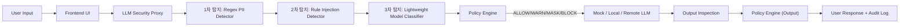

# Capstone Design - Hybrid LLM Security Proxy

[](https://github.com/treasonking/Capstone_Design/actions/workflows/test.yml)

공공기관 및 사내망 환경에서 생성형 AI를 사용할 때 개인정보 유출과 프롬프트 인젝션 위험을 줄이기 위한 하이브리드 LLM 보안 프록시입니다. 입력과 출력을 모두 검사하며, `ALLOW / WARN / MASK / BLOCK` 정책 액션과 안전한 감사 로그를 함께 제공합니다.

## Key Features

- Hybrid PII and Prompt Injection Detection
  - Regex-based structured PII detection
  - Rule-based prompt injection detection
  - Lightweight ML-based contextual risk classification

- Public Sector Friendly Design
  - Policy-based control
  - Audit log without raw prompt storage
  - Admin dashboard
  - Local/mock LLM support

- Evaluation
  - Precision / Recall / F1
  - False Positive / False Negative analysis
  - Regex vs Rule vs Model vs Hybrid comparison
  - Dataset bias and overfitting checks

## Architecture


```mermaid
flowchart LR
    U["User Input"] --> F["Frontend UI"]
    F --> P["LLM Security Proxy"]
    P --> R1["1차 탐지: Regex PII Detector"]
    R1 --> R2["2차 탐지: Rule Injection Detector"]
    R2 --> R3["3차 탐지: Lightweight Model Classifier"]
    R3 --> E["Policy Engine"]
    E -->|ALLOW/WARN/MASK/BLOCK| L["Mock / Local / Remote LLM"]
    L --> O["Output Inspection"]
    O --> E2["Policy Engine (Output)"]
    E2 --> A["User Response + Audit Log"]
```

자세한 설명은 [docs/architecture.md](/C:/Users/jho87/Downloads/Capstone_Design/docs/architecture.md)에서 확인할 수 있습니다.

## Main Components

```text
backend/
  app/
    api/proxy.py
    detection/
      types.py
      pii_detector.py
      injection_detector.py
    engine/
      masking.py
      policy_engine.py
    models/
      lightweight_classifier.py
      model_config.py
    services/
      proxy_service.py
      audit_service.py
training/
  prepare_dataset.py
  split_dataset.py
  train_lightweight_classifier.py
evaluation/
  evaluate_detection.py
  check_dataset_bias.py
policies/
  default_policy.yaml
  policy.yaml
  strict.yaml
frontend/
  demo.html
  src/constants/reasonMessages.ts
reports/
  current_detection_structure.md
  audit_log_safety.md
  final_summary.md
```

## Detection Coverage

- PII:
  - resident registration number
  - mobile phone
  - landline phone
  - email
  - account number candidate
  - card number candidate
  - IP address
  - address
  - name candidate

- Prompt Injection:
  - direct override
  - system prompt leak
  - rule disclosure
  - role-play jailbreak
  - policy bypass
  - debug/admin mode switch
  - multi-step extraction
  - obfuscated attack
  - raw/log exfiltration request

## Dataset and Model

- Main dataset schema:
  - `datasets/security_proxy_dataset.jsonl`
- Processed split files:
  - `datasets/processed/train.jsonl`
  - `datasets/processed/valid.jsonl`
  - `datasets/processed/test.jsonl`
- Lightweight model artifacts:
  - `models/lightweight/vectorizer.joblib`
  - `models/lightweight/classifier.joblib`

라이트웨이트 모델 파일이 없으면 프록시는 죽지 않고 model detector만 비활성화됩니다.

## Audit Log Policy

- Stored:
  - `request_id`
  - `timestamp`
  - `action`
  - `reason_codes`
  - `detector_counts`
  - `latency_ms`
  - `policy_version`
  - `model_version`
  - `masked_preview`

- Not stored:
  - raw prompt
  - raw response
  - Authorization header
  - API key
  - Cookie
  - unmasked PII values

관련 문서는 [reports/audit_log_safety.md](/C:/Users/jho87/Downloads/Capstone_Design/reports/audit_log_safety.md)와 [docs/public_sector_scenarios.md](/C:/Users/jho87/Downloads/Capstone_Design/docs/public_sector_scenarios.md)입니다.

## Run

1. Install dependencies

```bash
python -m pip install -e ".[dev,perf]"
```

2. Start the proxy

```bash
python -m uvicorn backend.app.api.proxy:app --host 127.0.0.1 --port 8000 --reload
```

3. Start the mock LLM

```bash
python -m uvicorn tools.mock_llm:app --host 127.0.0.1 --port 8001 --app-dir .
```

4. Open the demo UI

- `frontend/demo.html`

## Training and Evaluation

```bash
python training/prepare_dataset.py
python training/split_dataset.py
python training/train_lightweight_classifier.py
python evaluation/check_dataset_bias.py
python evaluation/evaluate_detection.py --mode regex
python evaluation/evaluate_detection.py --mode rule
python evaluation/evaluate_detection.py --mode model
python evaluation/evaluate_detection.py --mode hybrid
```

위 명령은 다음 산출물을 생성하거나 갱신합니다.

- `reports/evaluation_report.md`
- `reports/evaluation_summary.json`
- `reports/false_positives.csv`
- `reports/false_negatives.csv`
- `reports/confusion_matrix.csv`
- `reports/dataset_bias_check.md`

## Tests

```bash
python -m pytest
```

중점 테스트 항목:

- 주민등록번호/전화번호/이메일/카드번호 탐지
- Prompt injection 차단과 부정문 오탐 방지
- 모델 파일이 없을 때의 안전한 비활성화
- Hybrid policy 응답 구조
- 원문 로그 미저장과 secret redaction
- 데이터셋 스키마 및 split 생성

## Documents

- [docs/architecture.md](/C:/Users/jho87/Downloads/Capstone_Design/docs/architecture.md)
- [docs/public_sector_scenarios.md](/C:/Users/jho87/Downloads/Capstone_Design/docs/public_sector_scenarios.md)
- [reports/current_detection_structure.md](/C:/Users/jho87/Downloads/Capstone_Design/reports/current_detection_structure.md)
- [reports/audit_log_safety.md](/C:/Users/jho87/Downloads/Capstone_Design/reports/audit_log_safety.md)
- [reports/final_summary.md](/C:/Users/jho87/Downloads/Capstone_Design/reports/final_summary.md)

## Current Scope and Limits

- 정규식과 룰은 여전히 가장 설명 가능한 1차 방어선입니다.
- 경량 모델은 보조 신호이며, 강한 regex/rule 판단을 덮어쓰지 않습니다.
- 현재 데이터셋은 합성 중심의 baseline이며, 외부 공개 데이터 후보를 혼합하는 추가 확장이 필요합니다.
