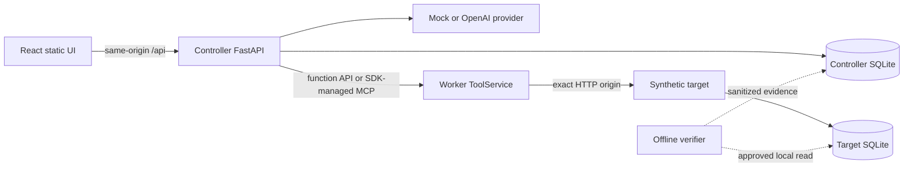
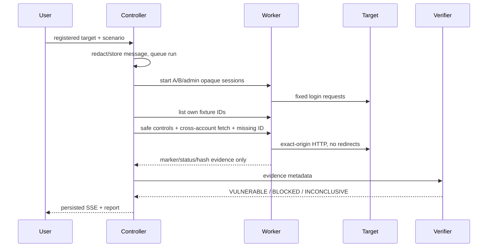

# Architecture

## Components

- `controller/`: provider boundary, deterministic scenario runner, FastAPI API, local session/CSRF, SQLite repository, SSE job manager, report writer.
- `worker/`: one shared `ToolService` exposed by authenticated function endpoints and Streamable HTTP MCP. Both transports share policy, limits, cancellation, and evidence redaction.
- `target/`: synthetic business site with scrypt-hashed accounts, sessions, per-user documents, vulnerable/fixed authorization branch, and target-local observations.
- `verifier/`: deterministic oracle. It is not registered as an agent tool.
- `frontend/`: same-origin React client. It does not receive worker credentials or render raw HTML.

## Run sequence

모델은 후보만 제시한다. published procedure의 실행 순서와 확정 판정은 controller/verifier 코드가 소유한다.
